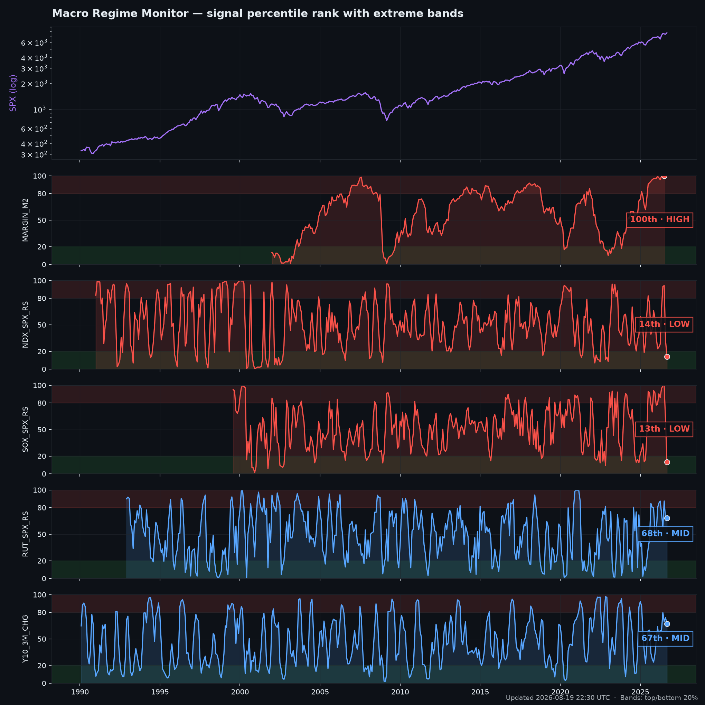
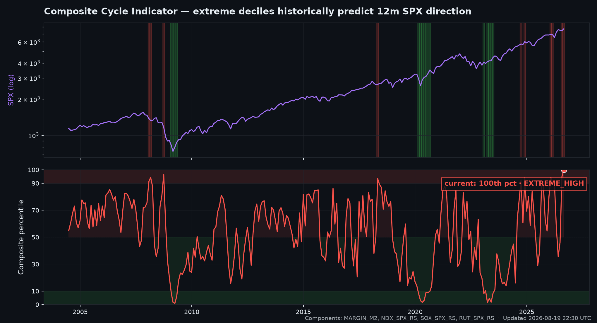
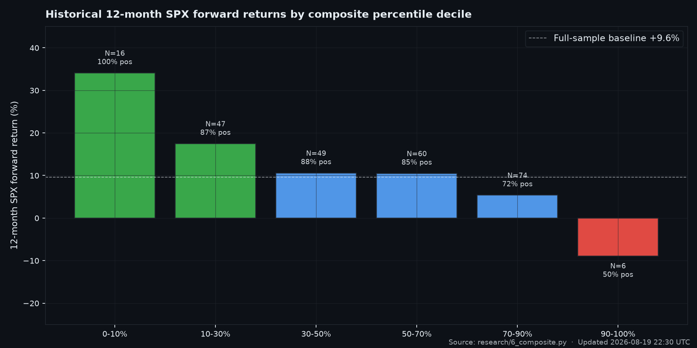
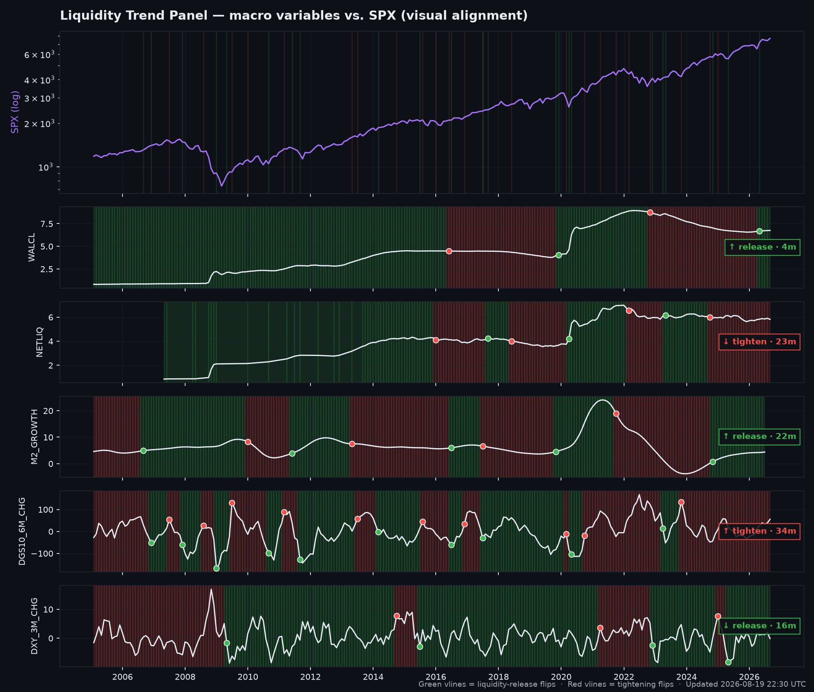
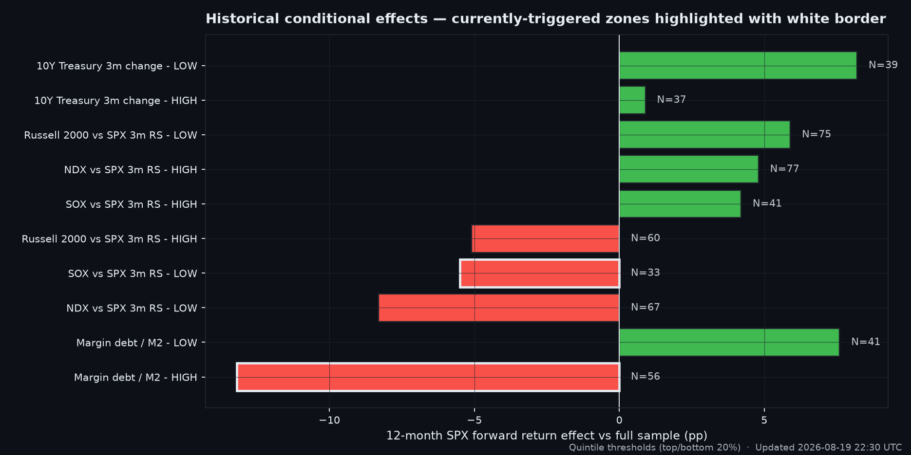

**English** · [中文](README.zh-CN.md)

# Macro Regime Monitor

> Tracks a curated set of liquidity, valuation, and market-internal signals against their historical extreme zones. Updates daily via GitHub Actions. **Not a strategy. A descriptive view of where we are.**

<!-- BEGIN:STAMP -->
_Last updated: **2026-08-19 22:30 UTC**  ·  Data: FRED · Yahoo Finance · FINRA_
<!-- END:STAMP -->

## Current state

<!-- BEGIN:HEADLINE -->
**Net 12-month historical effect from currently-triggered signals: `-27.0pp` — leans BEARISH.**

- Durable (Tier 1) signals triggered: **1 bearish, 0 bullish**
- Mostly-directional (Tier 2) signals triggered: **1 bearish, 0 bullish**
<!-- END:HEADLINE -->



## Composite cycle indicator

A weighted combination of the validated signals, designed as a medium-term (swing) auxiliary read of where the market sits in its macro cycle. Extreme percentiles (top/bottom decile of the composite's own history) historically carry significant 12-month forward-return effects; the mid range is honestly inconclusive.

<!-- BEGIN:COMPOSITE -->
Composite value: `+0.777`  ·  Composite percentile: `100%`  ·  Zone: **EXTREME_HIGH** (**↑ TOP-LEANING**)

_EXTREME HIGH (warning / top-leaning)_

Built from 4 components: MARGIN_M2, NDX_SPX_RS, SOX_SPX_RS, RUT_SPX_RS.
<!-- END:COMPOSITE -->



Historical 12-month SPX forward return by composite decile — both extreme deciles are statistically significant (bootstrap p < 0.001):



| Composite decile | N | 12m fwd SPX mean | Hit rate | vs. full-sample |
|---|---:|---:|---:|---:|
| **0-10% (extreme low / bottom setup)** | 14 | **+31.6%** | **100%** | **+22.0pp** |
| 10-30% (low / leaning setup) | 52 | +17.3% | 85% | +7.6pp |
| 30-50% (mid-low) | 71 | +10.0% | 83% | +0.3pp |
| 50-70% (mid-high) | 85 | +10.4% | 84% | +0.7pp |
| 70-90% (high / leaning warning) | 109 | +6.7% | 73% | -2.9pp |
| **90-100% (extreme high / top warning)** | 24 | **-10.1%** | **29%** | **-19.7pp** |

How to read the composite:
- Treat the **mid range (30-70%)** as inconclusive. Don't trade off a 50th-percentile composite reading.
- **Extreme low (≤10%)** has historically been a strong bottom-leaning setup — the small N=14 is honest, but every single one was followed by a positive 12-month return.
- **Extreme high (≥90%)** has historically been a top-leaning warning — 29% hit rate and -10% average forward return.
- This is auxiliary judgment, not a trading trigger. Use it to size discretionary positioning, not to flip on a single reading.

## Liquidity Trend Panel

A separate, **faster** lens than the composite. The composite tells you "where are we in the cycle" (slow, percentile-based). This panel tells you "what is trending which way right now" using SuperTrend applied to monthly macro variables — designed to detect regime inflections within 1-3 months of the event itself.

Validated at the 2020-03 Fed COVID pivot and 2022-01 QT pivot: SuperTrend(10, 2.0) on Net Liquidity flipped within 0.5m (2020) and 0.9m (2022). See `research/11_trend_inflection.py`.

<!-- BEGIN:TREND_PANEL -->
**Liquidity flow score: `+1/5` — **MIXED / no consensus****
  · 3 variables in release direction, 2 in tightening, 0 neutral

| Variable | Direction | Current | Last flip | Age | Implication |
|---|:-:|---:|:-:|---:|:-:|
| Fed Balance Sheet (WALCL) | ↑ UP | 6.754 | 2026-04 | 4.0m | 🟢 RELEASE |
| Net Liquidity (NETLIQ) | ↓ DOWN | 5.818 | 2024-09 | 23.0m | 🔴 TIGHTEN |
| M2 12-month growth (M2_GROWTH) | ↑ UP | 4.865 | 2024-08 | 21.9m | 🟢 RELEASE |
| 10Y Yield 6m change (DGS10_6M_CHG) | ↑ UP | 55.254 | 2023-10 | 34.0m | 🔴 TIGHTEN |
| DXY 3-month % change (DXY_3M_CHG) | ↓ DOWN | -0.144 | 2025-04 | 16.0m | 🟢 RELEASE |
<!-- END:TREND_PANEL -->



Reading guide:
- **WALCL / NETLIQ / M2 trending UP** → Fed adding liquidity (QE-like) → risk-on regime.
- **DGS10 / DXY trending UP** → tightening regime (rates rising or USD strengthening absorbs liquidity).
- **Score +5** = unanimous liquidity release. **Score −5** = unanimous tightening.
- Use the trend panel as the inflection alarm; use the composite for cycle-position context. They serve different timeframes.

## Signal table

<!-- BEGIN:SIGNAL_TABLE -->
| Signal | Current value | Percentile | Zone | Tier | Effect (12m fwd SPX) |
|---|---:|---:|:-:|:-:|---:|
| Margin debt / M2 | 0.065 | 100% | HIGH [BEAR] | DURABLE | -13.2pp |
| SOX vs SPX 3m RS | -10.024 | 13% | LOW [BEAR] | MOSTLY | -5.5pp |
| NDX vs SPX 3m RS | -4.601 | 14% | LOW [BEAR] | REGIME-DEP | -8.3pp |
| Market cap / M2 (Buffett indicator variant) | 3.252 | 100% | HIGH [BEAR] | TOMBSTONE | *failed stability test* |
| Russell 2000 vs SPX 3m RS | 2.167 | 68% | MID [mid] | — | — |
| 10Y Treasury 3m change | 19.433 | 67% | MID [mid] | — | — |
<!-- END:SIGNAL_TABLE -->

Zone marker decodes to historical bias when this signal is in this zone — not a recommendation. See `research/findings.md` for the audit trail and limitations of each signal.

## Historical conditional effects

How the 12-month forward SPX return distribution shifts when each signal is in its top-20% or bottom-20% historical zone, relative to the full-sample average. Bars with a white border are currently triggered.



## What's been tested

This repo is the production layer of a research project documented in `research/findings.md`. The full research pipeline tested 14 signal-zone combinations across decade-stratified subsamples with bootstrap permutation tests. Only signals that passed the stability test made it into the production dashboard.

What survived:

- **MARGIN_M2 HIGH** — *DURABLE* across 3 decades. Margin debt at top quintile vs M2 historically precedes a -13pp deterioration in 12m SPX returns.
- **MARGIN_M2 LOW** — *MOSTLY directional* (2 decades). Margin debt at bottom quintile precedes a +8pp boost.
- **NDX_SPX_RS HIGH** — *MOSTLY directional* (2 decades). Tech leadership extending precedes a +5pp boost.
- **SOX_SPX_RS HIGH** — *MOSTLY directional* (3 decades). Semis leading precedes a +4pp boost.
- **SOX_SPX_RS LOW** — *MOSTLY directional* (2 decades). Semis rolling over precedes a -5.5pp deterioration.

What was tested and killed (kept in the spec for transparency):

- **MCAP_M2 HIGH** ("Buffett indicator at extreme") — *failed stability*. The popular thesis is real only in the 2000s dot-com decade. In the 1990s and 2020s the same extreme reading carried essentially no forward-return effect. Shown in the table as a tombstone.
- **NDX_SPX_RS LOW** ("tech rolling over = warning") — *regime-dependent*. Worked in the 2000s. Did not work in the 1990s. Lives only in a post-dot-com regime.
- **M2_GROWTH LOW** — *signal flipped sign* between 1990s and 2010s. Cannot be applied.
- **NET_LIQUIDITY** — *insufficient data*. Only one full pre-COVID decade.

## Methodology

- Monthly resolution. Signals computed with expanding-window percentile (no look-ahead).
- Extreme zone definition: quintile thresholds (top 20% / bottom 20% of historical observations).
- Forward return horizon: 12 months. Conditional means tested against full-sample baseline.
- Statistical test: 2-sided permutation test, 2000 iterations, p-value vs null of no zone effect.
- Stability requirement: same-sign effect with >2pp magnitude in 3+ decades = DURABLE; 2 decades = MOSTLY; mixed = REGIME-DEPENDENT (excluded); single decade = INSUFFICIENT.
- Refresh cadence: daily at 22:00 UTC via GitHub Actions.

## Data sources

- [FRED M2SL](https://fred.stlouisfed.org/series/M2SL) — US M2 money supply (monthly).
- [FINRA Customer Margin Balances](https://www.finra.org/rules-guidance/key-topics/margin-accounts) — Margin debit balances (monthly).
- [Yahoo Finance](https://finance.yahoo.com/) — SPX, NDX, SOX, Wilshire 5000 (daily).

## Running locally

```bash
python -m venv .venv
source .venv/bin/activate          # Windows: .venv\Scripts\activate
pip install -r requirements.txt
python update.py
```

Charts land in `charts/`, snapshot in `data/latest.json`, README updates in place.

## What this is and isn't

**Is**: a descriptive snapshot of where current macro and market-internal readings sit in their historical distributions, plus what historically tended to follow when each was in the same zone. Honest about which signals survived stability testing.

**Isn't**: a trading strategy. The research phase explicitly rejected the strategy-as-deliverable framing — see `research/findings.md` for why. Use this as one input to discretionary judgment, not as a buy/sell trigger.

## Related

- [awesome-macro-liquidity](https://github.com/ruleaker/awesome-macro-liquidity) — Resource list for macro liquidity tracking.
- [awesome-derivatives-data](https://github.com/ruleaker/awesome-derivatives-data) — Resource list for crypto derivatives data.
- [net-liquidity-dashboard](https://github.com/ruleaker/net-liquidity-dashboard) — Daily Net Liquidity tracker (the broader macro picture).

## License

[MIT](LICENSE)
